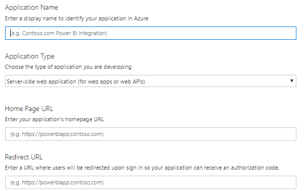
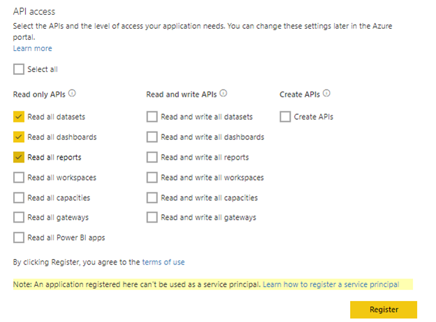
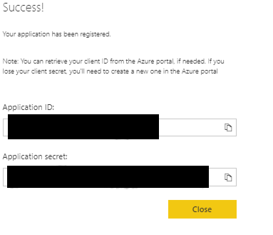
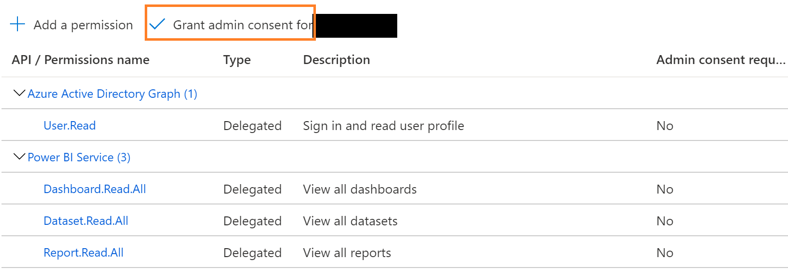
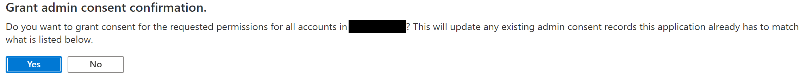
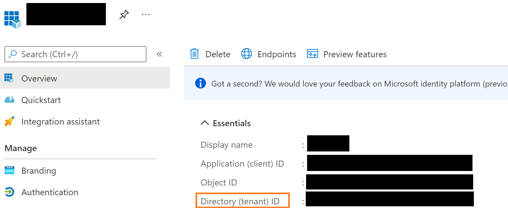
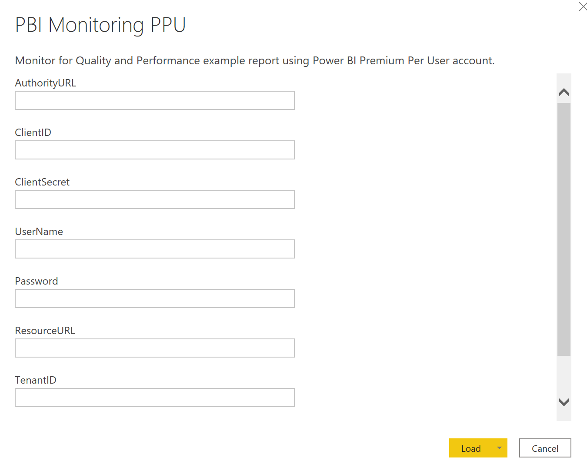

# Setting up Monitoring Report with Power BI Premium Per User

These instructions are a continuation from <a href="https://www.kerski.tech/bringing-dataops-to-power-bi-part2/" target="_blank">Part 2 of Bringing DataOps to Power BI</a>.  The steps below describe how to setup the "PBI Monitoring.pbit" file to monitor a workspace.

> ***Important Note**: This guide is customized to Power BI for U.S. Commercial environment. If you are trying to set this up for another Microsoft cloud environment (like U.S. Gov Cloud), please check Microsoft's documentation for the appropriate URLs. They will be different from the U.S. Commercial environment.*

## Prerequisites

-   Power BI Premium Per User license assigned to a service account. If you do not have a Premium Per User license, use the "Buy Now" feature on <a href="https://docs.microsoft.com/en-us/power-bi/admin/service-premium-per-user-faq" target="_blank">Microsoft's site</a> or if you don't have access to do that, please contact your administrator (be nice!).

-   Power BI Workspace assigned for Premium Per User (<a href="https://docs.microsoft.com/en-us/power-bi/collaborate-share/service-create-the-new-workspaces>" target="_blank">see instructions</a>). You can get the Workspace id from the URL. For example the bolded section of the URL is the Workspace ID: https://app.powerbi.com/groups/**exxxx-5xd3-xxxx-8d1a-a25c761ad330**/list/dashboards

-   Service account granted admin permissions to Power BI Workspace.

-   Power BI Desktop installed on device executing these steps.

### Steps
### 1. Register an application in Azure Active Directory

Use the App registration tool to register an app for Power BI Embedded on Azure Active Directory.

1.  Navigate to the URL: [https://app.powerbi.com/apps](https://app.powerbi.com/apps)

2.  Sign in using your account.

3.  Complete registration by entering the following:

-   **Application Name** will be used to identify your Azure App on Azure Active Directory (AD). 

-   **Application Type** should be 'Server-side web application'.

-   **Home Page URL**. You can use http://localhost.

-   **Redirect URL** should be the URL where users will be redirected upon sign in, so your application can receive an authorization code. You can use http://localhost.

4.  Select the following APIs (check screenshot below) and select the register button.

5.  Make a note of the Application ID and Application secret. Also, open the highlighted hyperlink labeled "Learn how to register a service principal".

> *Application ID: xxxxxxx*
>
> *Application secret: xxxxxxxx*

6. At this point, you have registered the Azure App. **However**, note that the app is not yet enabled to be used in the tenant. Please follow the instructions you opened in step 4.  

### 2. Grant Admin Consent

> ***Important Note**: If you do not have administration rights to the tenant you will need to talk to an administrator about the tasks required in Step 2.*

1. Visit <a href="https://portal.azure.com/#blade/Microsoft_AAD_IAM/ActiveDirectoryMenuBlade/RegisteredApps">Azure AD Registered Apps</a>.

2. Login with your account.

3. Select the app you created in Step 1 and navigate to API permissions.

4. Select the "Grant admin consent..." option.

5. You will be prompted to confirm, select Yes.

6. Navigate back to the Overview section for the app and copy the Tenant ID for Step 3. 

### 3. Update PBI Monitoring PPU template

1. Open "PBI Monitroing PPU.pbit". You will be prompted to enter the fields you should have saved from the prior steps.

2.  Enter the following:

-   **AuthorityURL**: https://login.microsoftonline.com

-   **ClientID** This is the equivalent to the Application ID saved in Step 1.

-   **ClientSecret**. This is the equivalent to the Application Secret saved in Step 1.

-   **UserName**. This is the username for the service account with the Premium Per User License.

-   **UserName**. This is the password for the service account with the Premium Per User License.

-   **ResourceURL**: https://analysis.windows.net/powerbi/api

-   **TenantID**. This should have been saved after completing Step 2.

-   **PROD_PBIWorkspaceGroupID**. This should have been saved after completing the prerequisites.

3. Press the "Load" button.

4. You may be prompted to update the privacy levels. Select the ignore Privacy levels text box and press the Save button.

5. It may take a few minutes to load the data, but if all steps and permissions are set correctly the report should load.

